# Design Guidelines and Documentation

> ⚠️ Please note that this documentation is provided for **quick reference** only. Some details contained here may be out-of-date or inaccurate. **For the most up-to-date and accurate information, refer to the [design-guide](../apps/guide/README.md) app.**

## Color Palette

Republic Services’ color palette is simple and strong. By effectively using a few colors, we can ensure a consistent visual language on all Republic Services materials and promotions. Proper application of these colors will be detailed in the following pages. Please use only Republic Services approved colors and formulas as specified in this guide. This palette is not to be added to or subtracted from. The colors are not to be screened, layered or otherwise changed in base or tonality, except where explicitly noted here in the brand guidelines.

### Primary Palette

|Hexadecimal Color  | RGBA Color | HTML Color | Contrast 
|:------------- | :------------- | :------------- | :-------------
 4575ac |rgba (69,117,172,1) | @primaryBlueLight | ffffff
 004a7c |rgba (0,74,124,1) | @primaryBlue | ffffff
 00234f |rgba (0,35,79,1) | @primaryBlueDark | ffffff
 E0E9EF |rgba (224,233,239,1)| @50 | 000000
 B3C9D8 |rgba (179,201,216,1)| @100 | 000000
 80A5BE |rgba (128,165,190,1)| @200 | 000000
 4D80A3 |rgba (77,128,163,1)| @300 | ffffff
 266590 |rgba (38,101,144,1)| @400 | ffffff
 004A7C |rgba (0,74,124,1)| @500 | ffffff
 004374 |rgba (0,67,116,1)| @600 | ffffff
 003a69 |rgba (0,58,105,1)| @700 | ffffff
 00325f |rgba (0,50,95,1)| @800 | ffffff
 00224c |rgba (0,34,76,1)| @900 | ffffff
```
$mdThemingProvider.definePalette('primary', {
  '50': 'e0e9ef',
  '100': 'b3c9d8',
  '200': '80a5be',
  '300': '4d80a3',
  '400': '266590',
  '500': '004a7c',
  '600': '004374',
  '700': '003a69',
  '800': '00325f',
  '900': '00224c',
  'A100': '80acff',
  'A200': '4d8bff',
  'A400': '1a6aff',
  'A700': '0059ff',
  'contrastDefaultColor': 'light',
  'contrastDarkColors': [
    '50',
    '100',
    '200',
    'A100',
    'A200'
  ],
  'contrastLightColors': [
    '300',
    '400',
    '500',
    '600',
    '700',
    '800',
    '900',
    'A400',
    'A700'
  ]
});
```

### Secondary Palette

|Hexadecimal Color  | RGBA Color | HTML Color | Contrast
|:------------- | :------------- | :------------- | :-------------
 e4f6fd |rgba(228, 246, 253, 1) |@secondaryBlueLight |000000
 00adef |rgba(0, 173, 239, 1) |@secondaryBlue | 000000
 2b566b |rgba(43, 86, 107, 1) |@secondaryBlueDark | ffffff
 e0f5fd | rgba(224,245,253,1) | @50  | 000000
 b3e6fa | rgba(179,230,250,1) | @100  | 000000
 80d6f7 | rgba(128,214,247,1) | @200  | 000000
 4dc6f4 | rgba(77,198,244,1) | @300  | 000000
 26b9f1 | rgba(38,185,241,1) | @400  | 000000
 00adef | rgba(0,173,239,1) | @500  | 000000
 00a6ed | rgba(0,166,237,1) | @600  | ffffff
 009ceb | rgba(0,156,235,1) | @700  | ffffff
 0093e8 | rgba(0,147,232,1) | @800  | ffffff
 0083e4 | rgba(0,131,228,1) | @900  | ffffff

```
$mdThemingProvider.definePalette('secondary', {
 '50': 'e0f5fd',
  '100': 'b3e6fa',
  '200': '80d6f7',
  '300': '4dc6f4',
  '400': '26b9f1',
  '500': '00adef',
  '600': '00a6ed',
  '700': '009ceb',
  '800': '0093e8',
  '900': '0083e4',
  'A100': 'ffffff',
  'A200': 'd8ecff',
  'A400': 'a5d4ff',
  'A700': '8bc8ff',
  'contrastDefaultColor': 'light',
  'contrastDarkColors': [
    '50',
    '100',
    '200',
    '300',
    '400',
    '500',
    'A100',
    'A200',
    'A400',
    'A700'
  ],
  'contrastLightColors': [
    '600',
    '700',
    '800',
    '900'
  ]
});
```
### Alert Palette

|Hexadecimal Color  | RGBA Color | HTML Color | Contrast
|:------------- | :------------- | :------------- | :-------------
 ea796c |rgba(234, 121, 108, 1) |@alertRedLight | 000000
 ac1500 |rgba(172, 21, 0, 1) |@alertRed | ffffff
 660a00 |rgba(102, 10, 0, 1) |@alertRedDark | ffffff
 f5e3e0 | rgba(245,227,224,1) | @50  | 000000
 e6b9b3 | rgba(230,185,179,1) | @100  | 000000
 d58a80 | rgba(213,138,128,1) | @200  | 000000
 c45b4d | rgba(196,91,77,1) | @300  | ffffff
 b73826 | rgba(183,56,38,1) | @400  | ffffff
 aa1500 | rgba(170,21,0,1) | @500  | ffffff
 a31200 | rgba(163,18,0,1) | @600  | ffffff
 990f00 | rgba(153,15,0,1) | @700  | ffffff
 900c00 | rgba(144,12,0,1) | @800  | ffffff
 7f0600 | rgba(127,6,0,1) | @900  | ffffff

```
$mdThemingProvider.definePalette('alert', {
  '50': 'f5e3e0',
  '100': 'e6b9b3',
  '200': 'd58a80',
  '300': 'c45b4d',
  '400': 'b73826',
  '500': 'aa1500',
  '600': 'a31200',
  '700': '990f00',
  '800': '900c00',
  '900': '7f0600',
  'A100': 'ffadad',
  'A200': 'ff7b7a',
  'A400': 'ff4847',
  'A700': 'ff2f2d',
  'contrastDefaultColor': 'light',
  'contrastDarkColors': [
    '50',
    '100',
    '200',
    'A100',
    'A200'
  ],
  'contrastLightColors': [
    '300',
    '400',
    '500',
    '600',
    '700',
    '800',
    '900',
    'A400',
    'A700'
  ]
});
```
### Greys Palette

|Hexadecimal Color  | RGBA Color | HTML Color | Contrast
|:------------- | :------------- | :------------- | :-------------
 f3f4f5 |rgba(243,244,245,1) |@50 | 000000
 e2e3e6 |rgba(226,227,230,1) |@100 | 000000
 cfd1d5 |rgba(207,209,213,1) |@200 | 000000
 bcbec4 | rgba(188,190,196,1) | @300  | 000000
 adb0b7 | rgba(173,176,183,1) | @400  | 000000
 9fa2aa | rgba(159,162,170,1) | @500  | 000000
 979aa3 | rgba(151,154,163,1) | @600  | 000000
 8d9099 | rgba(141,144,153,1) | @700  | 000000
 838690 | rgba(131,134,144,1) | @800  | 000000
 72757f | rgba(114,117,127,1) | @900  | ffffff

```
$mdThemingProvider.definePalette('grey', {
  '50': 'f3f4f5',
  '100': 'e2e3e6',
  '200': 'cfd1d5',
  '300': 'bcbec4',
  '400': 'adb0b7',
  '500': '9fa2aa',
  '600': '979aa3',
  '700': '8d9099',
  '800': '838690',
  '900': '72757f',
  'A100': 'ffffff',
  'A200': 'd1dafc',
  'A400': '9bb0ff',
  'A700': '819cff',
  'contrastDefaultColor': 'light',
  'contrastDarkColors': [
    '50',
    '100',
    '200',
    '300',
    '400',
    '500',
    '600',
    '700',
    '800',
    'A100',
    'A200',
    'A400',
    'A700'
  ],
  'contrastLightColors': [
    '900'
  ]
});
```
### Accent Palette

|Hexadecimal Color  | RGBA Color | HTML Color |
|:------------- | :------------- | :-------------
 ffd097 |rgba(255, 208, 151, 1) |@peach-orange
 f38a00 |rgba(243, 138, 0, 1) |@tangerine
 834a07 |rgba(131, 74, 7, 1) |@rusty-nail
 d4c8fc |rgba(212, 200, 252, 1) |@perfume
 9d8ae1 |rgba(157, 138, 225, 1) |@lavender
 432f7f |rgba(67, 47, 127, 1) |@mulled-wine
 ff97b5 |rgba(255, 151, 181, 1) |@pink-salmon
 d01947 |rgba(208, 25, 71, 1) |@crimson
 750c2a |rgba(117, 12, 42, 1) |@cherry
 cfffbd |rgba(207, 255, 189, 1) |@successGreenLight
 64c644 |rgba(100, 198, 68, 1) |@successGreen
 2c541c |rgba(44, 84, 28, 1) |@successGreenDark

```
$mdThemingProvider.definePalette('accent', {
  '50': 'fef1e0',
  '100': 'fbdcb3',
  '200': 'f9c580',
  '300': 'f7ad4d',
  '400': 'f59c26',
  '500': 'f38a00',
  '600': 'f18200',
  '700': 'ef7700',
  '800': 'ed6d00',
  '900': 'ea5a00',
  'A100': 'ffffff',
  'A200': 'ffe8de',
  'A400': 'ffc6ab',
  'A700': 'ffb491',
  'contrastDefaultColor': 'light',
  'contrastDarkColors': [
    '50',
    '100',
    '200',
    '300',
    '400',
    '500',
    '600',
    '700',
    '800',
    'A100',
    'A200',
    'A400',
    'A700'
  ],
  'contrastLightColors': [
    '900'
  ]
});
```

## Typography

### Open Sans

Open Sans is a humanist sans serif typeface designed by Steve Matteson, Type Director of Ascender Corp. Open Sans was designed with an upright stress, open forms and a neutral, yet friendly appearance. It was optimized for print, web and mobile interfaces, and has excellent legibility characteristics in its letterforms. For more information and to download Opens visit the [Open Sans font page](https://fonts.google.com/specimen/Open+Sans).

### Open Sans Weights Used

* Light
* Normal
* Semi-Bold
* Bold
* Extra-Bold

### Heading Styles

|Heading Label  | Font Size | Font Weight | Leading | Transform
|:------------- | :------------- | :------------- | :------------- | :-------------
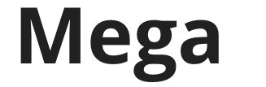 | 96px | Bold | 80px | None
 | 60px | Bold | 60px | None
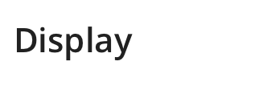 | 42px | Semibold | 40px | None
 | 38px | Light | 32px| None
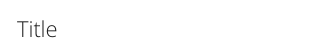 | 22px | Light | 28px | None
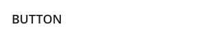 | 18px | Semibold | 28px | Uppercase

### Paragraph Styles

|Heading Label  | Font Size | Font Weight | Leading | Transform
|:------------- | :------------- | :------------- | :------------- | :-------------
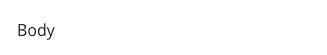 | 16px | Regular | 24px | None
 | 16px | Semibold | 24px | Underline
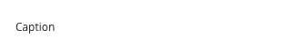 | 12px | Regular | 20px | None

### Usage

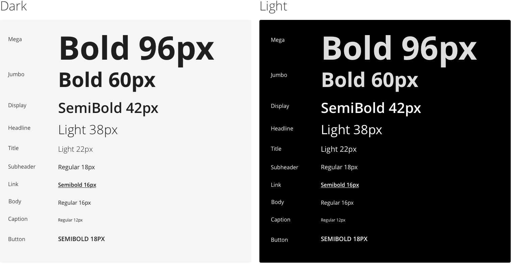

### Type Scale

Device size determines the units and scale for our typography for information on type scale visit: [Material Design Type Scale](https://material.io/design/typography/the-type-system.html#)

## Buttons

Buttons can be represented as any color in the primary ADA Contrast compliant palette as follows:

### Solid Button


### Oultine Button


### Icon Fill Button


### Icon Outline Button


### Icon Button


### Button Color options

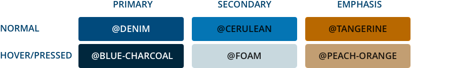

### Button Sizes


For more information on buttons visit: [Material Design Buttons](https://material.io/design/components/buttons.html#)

## Text Inputs

Inputs or ‘text fields’ are important interactive elements that allow users to enter text into a UI. They typically appear in forms and dialogs. General usage includes email subscription forms, ecommerce, surveys and search. When designing Inputs should:

* *Discoverable* - Inputs should stand out and intuitive to users that they can input information.

* *Clear* - Text field states should be clearly differentiated from one another. Text fields should make it easy to understand the requested information and to address any errors.

* *Accessible* - Inputs should be keyboard navigable, Errors should be prominent and legible, screen readers should be able to translate placeholder text and errors accordingly.

### Anatomy

Inputs are component made up of many optional elements depending on use. 

| Options | Spec
|:------------- | :------------- |
| * Container <br> * Normal <br> * Input text <br> * Trailing icon (optional) <br> * Activation indicator <br> * Helper text (optional)| 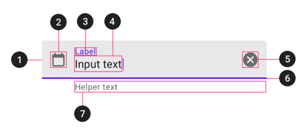

### Single Line Input


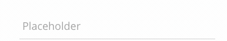

### Outline Input


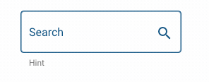

For more information on text inputs visit: [Material Design Inputs](https://material.io/design/components//text-fields.html#anatomy)


## Snackbars
Snackbars inform users of a process that an app has performed or will perform. They appear temporarily, towards the bottom of the screen.

### Behavior
Snackbars appear without warning, and don't require user interaction. They automatically disappear from the screen after a minimum of four seconds, and a maximum of ten seconds. When multiple snackbar updates are necessary, they should appear one at a time.

|Type  | Example | Spec
|:------------- | :------------- | :------------- |
| Single-line with Action | 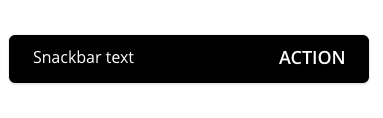 | 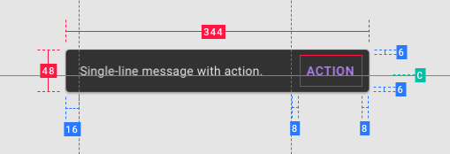
| Multi-line with Action |  | 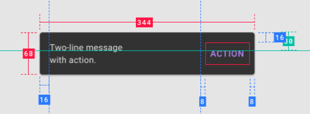

For more information on snackbars visit:
[Material Design Snackbars](https://material.io/design/components/snackbars.html)

## Banners
A banner displays a prominent message and related optional actions.

### Behavior
Banners typically appear when a screen loads content.
Banners that appear after a screen loads should animate on screen from the top of a layout. If the banner is at the same elevation as content, it pushes content downwards.

|Type  | Example | Spec
|:------------- | :------------- | :------------- |
| Multi-line Banner | 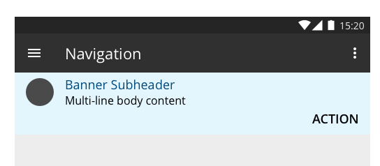 | 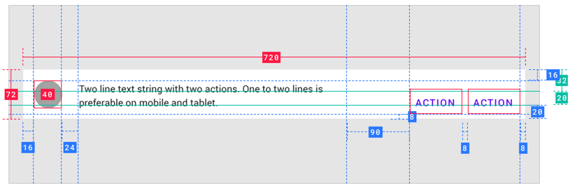

For more information on banners visit:
[Material Design Banners](https://material.io/design/components/banners.html)

## Modal Dialogs
A dialog is a type of modal window that appears in front of app content to provide critical information or ask for a decision. Dialogs disable all app functionality when they appear, and remain on screen until confirmed, dismissed, or a required action has been taken. Dialogs are purposefully interruptive, so they should be used sparingly.

### Behavior
Modals are initiated when the user needs to take action in order to fulfill a pre-designated task. They require users to stop their current task. They should be used sparingly, as not every choice or setting warrants interruption. Modals retain focus until dismissed or an action has been taken, such as choosing a setting. They shouldn’t be obscured by other elements or appear partially on screen, with the exception of full-screen dialogs. Most dialog content should avoid scrolling. When scrolling is required, the dialog title is pinned at the top, with buttons pinned at the bottom. This ensures selected content remains visible alongside the title and buttons, even upon scroll. Dialogs don’t scroll with elements outside of the dialog, such as the background.

|Type  | Example | Spec
|:------------- | :------------- | :------------- |
| Multi-line Dialog | 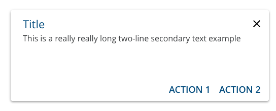 | 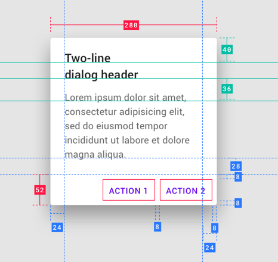

For more information on modal dialogs visit:
[Material Design Dialogs](https://material.io/design/components/dialogs.html)

## Breakpoints
Mobile first fluid grid system that appropriately scales up to 12 columns as the device or viewport size increases. It includes predefined classes for easy layout options, as well as powerful mixins for generating more semantic layouts. Our breakpoints are as follows: 

|Mobile | Desktop |
|:------------- | :------------- |
| _320px_ to _767px_ | _768px_ to and above

Please refer to [Material Design breakpoints](https://material.io/design/layout/responsive-layout-grid.html#breakpoints) documentation.
